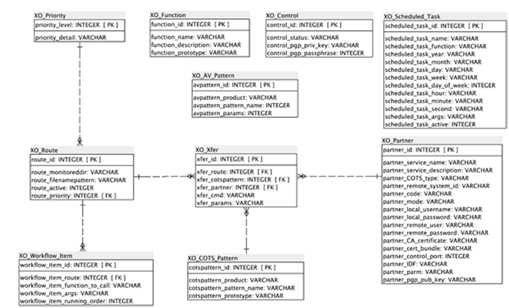

# Configuring xfero

Xfero is configured via the Navigator GUI. The GUI is used to build configuration information into the Xfero database which is an SQLite relational database.

SQLite is a software library that implements a self-contained, server-less, zero-configuration, transactional SQL database engine. SQLite is the most widely deployed SQL database engine in the world. The source code for SQLite is in the public domain.

It provides sophisticated scheduling, monitoring, workflow and transformation capabilities which enables effective automation and protocol switching.

# Data Model

## Table Definitions & Column Descriptions

### List of Tables:

* Control
* COTS_Pattern
* Function
* Partner
* Priority
* Route
* Scheduled_Task
* Workflow_Item
* Xfer

### Control

Controls status of xfero and facilitates tidy startup and closedown. Ensuring in flight processing completes before closing down.

Column Name       | Type  | PK | Nullable
------------------|-------|----|-------------------------
``control_id``    | INT   | PK | NOT NULL
``control_status``| TEXT  |    | NOT NULL
``control_pgp_priv_key``| TEXT  |    | NULL     
``control_pgp_passphrase``| TEXT  |    | NULL

### COTS_Pattern

Holds specific information about COTS Products configured with xfero.

Column Name       | Type  | PK | Nullable
------------------|-------|----|-------------------------
``cotspattern_id``| INT   | PK | NOT NULL
``cotspattern_product``| TEXT  |    | NOT NULL
``cotspattern_pattern_name``| TEXT  |    | NOT NULL
``cotspattern_prototype``| TEXT  |    | NOT NULL

Referenced By ``Xfer referencing (cotspattern_id)``

### Function

Defined Functions which can be called as part of the workflow.

Column Name       | Type  | PK | Nullable
------------------|-------|----|-------------------------
``function_id``| INT   | PK | NOT NULL
``function_name``| TEXT  |    | NOT NULL
``function_description``|TEXT  |    |          
``function_prototype``| TEXT  |    |

### Partner

Holds details of partner sites in terms of COTS products used to transfer files. The information held in this table is used to replace elements from the
COTS_Pattern selected when creating the Xfer record.

Column Name       | Type  | PK | Nullable
------------------|-------|----|-------------------------
``partner_id``    | INT   | PK | NOT NULL
``partner_service_name``| TEXT  |    | NOT NULL
``partner_service_description``| TEXT  |    |       
``partner_COTS_type``| TEXT  |    | NOT NULL
``partner_remote_system_id``| TEXT  |    | NOT NULL
``partner_code``| TEXT  |    |          
``partner_mode``| TEXT   |    |
``partner_local_username``| TEXT  |    |          
``partner_local_password``| TEXT  |    |          
``partner_remote_user``| TEXT  |    |          
``partner_remote_password``| TEXT  |    |          
``partner_CA_certificate``| TEXT  |    |          
``partner_cert_bundle``| TEXT  |    |          
``partner_control_port``| TEXT  |    |          
``partner_IDF``| TEXT  |    |          
``partner_parm``| TEXT  |    |          
``partner_pgp_pub_key``| TEXT  |    |          

Referenced By ``Xfer referencing (partner_id)``

### Priority

Table containing priorities to be associated with transfers. Each Priority will be assigned to a scheduled task and will be used to determine the frequency that scheduled jobs are executed.

When a route is specified it will be assigned a priority.

Column Name       | Type  | PK | Nullable
------------------|-------|----|-------------------------
``priority_level``| INT   | PK | NOT NULL
``priority_detail``| TEXT  |    | NOT NULL

Referenced By ``Route referencing (priority_level)``

### Route

Stores information about routes that have been configured

Column Name       | Type  | PK | Nullable
------------------|-------|----|-------------------------
``route_id``      | INT   | PK | NOT NULL
``route_monitoreddir``| TEXT  |    | NOT NULL
``route_filenamepattern``| TEXT  |    | NOT NULL
``route_active``  | INT   |    | NOT NULL
``route_priority``| INT   |    | NOT NULL

References ``Priority through (route_priority)``

Referenced ``Workflow_Item referencing (route_id)``

Referenced By ``Xfer referencing (route_id)``

### Scheduled_Task

Holds information that specifies scheduling information for tasks to be performed

Column Name       | Type  | PK | Nullable
------------------|-------|----|-------------------------
``scheduled_task_id``| INT   | PK | NOT NULL
``scheduled_task_name``| TEXT  |    | NOT NULL
``scheduled_task_function``| TEXT  |    | NOT NULL
``scheduled_task_year``| INT   |    |          
``scheduled_task_month``| INT   |    |          
``scheduled_task_day``| INT   |    |          
``scheduled_task_week``| INT   |    |          
``scheduled_task_day_of_week``| TEXT  |    |          
``scheduled_task_hour``| INT   |    |          
``scheduled_task_minute``| INT   |    |          
``scheduled_task_second``| INT   |    |          
``scheduled_task_args``| TEXT  |    | NOT NULL
``scheduled_task_active``| INT   |    | NOT NULL

### Workflow_Item

Table contains items that make up a workflow. A workflow for a specific route can be made up of many workflow items. Each workflow item will perform a specific function on the file prior to transferring the file.

Column Name       | Type  | PK | Nullable
------------------|-------|----|-------------------------
``workflow_item_id``| INT   | PK | NOT NULL
``workflow_item_route``| INT   |    | NOT NULL
``workflow_item_function_to_call``| TEXT  |    | NOT NULL
``workflow_item_args``| TEXT  |    |          
``workflow_item_running_order``| INT   |    | NOT NULL

References ``XO_Route through (workflow_item_route)``

### Xfer

Holds details of file transfers to perform

Column Name       | Type  | PK | Nullable
------------------|-------|----|-------------------------
``xfer_id``       | INT   | PK | NOT NULL
``xfer_route``    | INT   |    | NOT NULL
``xfer_cotspattern``| INT   |    | NOT NULL
``xfer_partner``  | INT   |    | NOT NULL
``xfer_cmd``      | TEXT  |    | NOT NULL
``xfer_params``   | TEXT  |    | NOT NULL

References ``XO_Route through (xfer_route)``

References ``XO_COTS_Pattern through (xfer_cotspattern)``

References ``XO_Partner through (xfer_partner_id)``
